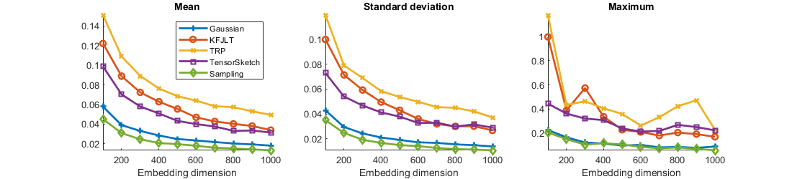
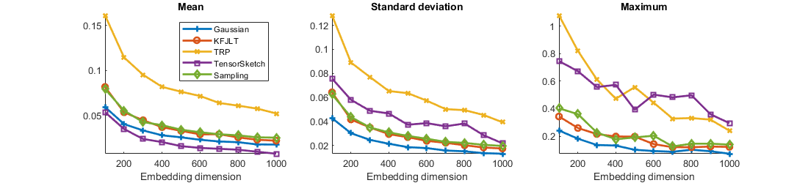
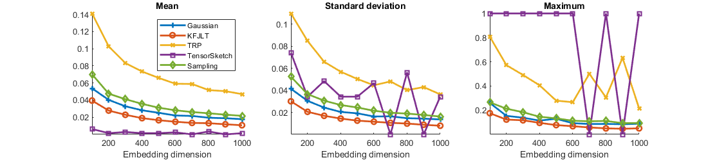
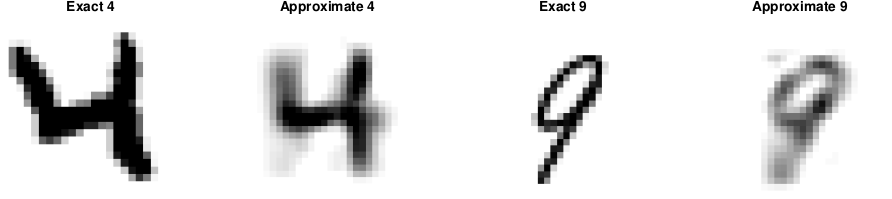
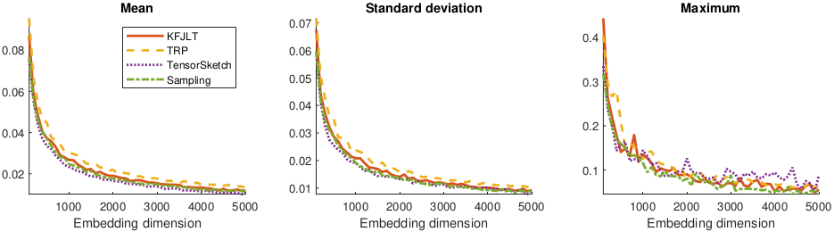

# Comparison of Different Methods for Sketching of Kronecker Vectors
This is an implementation of experiments that compare five different sketch methods when applied to vectors with Kronecker structure. 
For further information on the experiments and their results, please see our paper:

O. A. Malik and S. Becker. *Guarantees for the Kronecker fast Johnson–Lindenstrauss transform using a coherence and sampling argument*. **Linear Algebra and its Applications** 602, pp. 120-137, 2020. [[DOI link](https://doi.org/10.1016/j.laa.2020.05.004)] [[arXiv preprint](https://arxiv.org/abs/1911.08424)]

## Some Further Details
The script **experiment1** runs the experiments we present in Section 5.1 of our paper. It compares five different sketch types:
* A Gaussian sketch
* The Kronecker fast Johnson-Lindenstrauss transform (KFJLT)
* Tensor Random Projection (TRP)
* TensorSketch
* Sampling based on estimated leverage scores

The script allows choosing between three different distributions for the Kronecker vectors: normal, sparse, and a single large entry. The three figures below show the results we present in our paper for each of the three different distribution types. 


*Fig. 1: Normal distribution*


*Fig. 2: Sparse distribution*


*Fig. 3: Single large entry*

The script **experiment2** runs the experiment we present in Section 5.2 of our paper. It compares the KFJLT, TRP, TensorSketch and estimated leverage score sampling methods when applied to tensors in CP format. The tensors represent approximations of MNIST digits 4 and 9. Fig. 4 shows an example of a 4 and a 9, with their corresponding approximations. Fig. 5 shows the results from applying the sketches to these tensors.


*Fig. 4: Example of a 4 and a 9 with corresponding approximations*


*Fig. 5: Results of sketching tensors*

Please see our paper for further details.

## Requirements
Portions of our code requires Tensor Toolbox version 2.6 by Bader, Kolda and others (available at http://www.sandia.gov/~tgkolda/TensorToolbox/).

## Installation
Run the file **compile_all_mex.m** inside the folder help_functions. Alternatively, simply compile each C file individually by running "mex filename.c" inside Matlab.

## Referencing This Code
If you use our code in any of your own work, please reference our paper:
```
@article{MALIK2020120,
	title = "Guarantees for the {K}ronecker fast {J}ohnson--{L}indenstrauss transform using a coherence and sampling argument",
	journal = "Linear Algebra and its Applications",
	volume = "602",
	pages = "120-137",
	year = "2020",
	issn = "0024-3795",
	doi = "https://doi.org/10.1016/j.laa.2020.05.004",
	url = "http://www.sciencedirect.com/science/article/pii/S0024379520302354",
	author = "Osman Asif Malik and Stephen Becker",
	keywords = "Johnson–Lindenstrauss lemma, Subspace embedding, Sketching, Kronecker product, Tensor product",
}
```

We have tried our best to include references in our code to other works we use, so please also reference those works as appropriate.

## Author Contact Information
Please feel free to contact me at any time if you have any questions or would like to provide feedback on this code or on our paper. I can be reached at osman.malik@colorado.edu.
